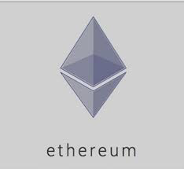

# blockchain-dev-meetup-basel
### Contents for Basel Blockchain for Developers Meetup

here you will find the documentation/resources and links needed for our group Meetups.
Topics are:
* Blockchain
* Ethereum
* Smart Contracts
* Bitcoin
* Cryptography
* Hyperleger
* IOTA

----

----

----

----

----

## Links & definitions for Ethereum
* Ethereum 
blockchain on which you can build decentralized applications (smart contracts)
https://ethereum.org

* Ether:
Ethereum base cryptocurrency (base token).
https://ethereum.org/ether

* Geth
client software provided by the Ethereum written in Go with the the following components:
-Daemon: downloads a copy of the blockchain, interacts with other nodes, mines,  validates & executes transactions,
 exposes API ( RPC) 
-Console: command line console, connect to an active nodes, and execute commands ( create accounts..)
https://ethereum.org/cli

*Mainnet 
The live Ethereum blockchain which works using ether
https://www.ethernodes.org/network/1
https://etherscan.io

*Testnet
A real Ethereum blockchain which works using test ethers and is used by developers for testing application. 
https://www.ethernodes.org/network/2

* MIST
User freindly Ehtereum Client (GUI), includes geth
https://github.com/ethereum/mist
*TestRPC 
A local simulation of an Ethereum Blockchain ( virtual)
https://github.com/ethereumjs/testrpc

* Web3.js
javascript library to interact with the nodes and which eases the use of RPC 
https://github.com/ethereum/wiki/wiki/JavaScript-API

* Solidity
programming language to write smart contracts on the Ethereum blockchain (compiled to Ethereum Virtual Machine byte code)
https://solidity.readthedocs.io/en/develop/
https://github.com/ConsenSys/smart-contract-best-practices

* Remix
 A Browser based IDE for Solidity
 https://remix.ethereum.org/#version=soljson-v0.4.17+commit.bdeb9e52.js
 download https://github.com/ethereum/browser-solidity
 
* DApp
 A Smart Contract on the Blockchain + Application ( UI+logic usually in HTML + JavaScript)
 http://ethdocs.org/en/latest/contracts-and-transactions/developer-tools.html
 Live Dapps:
 https://www.stateofthedapps.com
 
 *IPFS  
 A peer-to-peer distributed file system 
 
 *Total Ether Supply
 https://etherscan.io/stat/supply
 The current issuance rate is known: 5 ETH every ~15 seconds (Bitcoin is currently 25 BTC every ~10mins).
 https://www.coindesk.com/what-to-know-trading-ethereum/
 http://blockchain.info
 https://btc.com
 https://btc.com/stats/pool?pool_mode=year
 
 *tutorials
 http://remix.readthedocs.io/en/latest/tutorial_mist.html
 